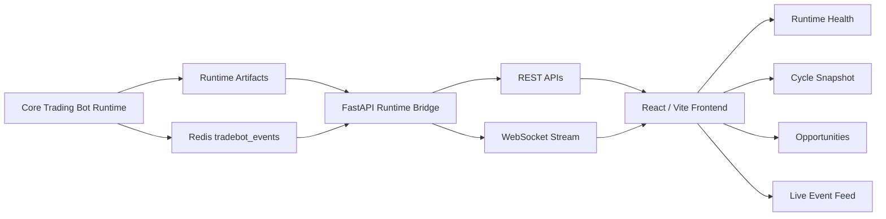

# Algotradify

[](https://github.com/ramgolladi1503-sys/algotradify/actions/workflows/portfolio-ci.yml)

**Runtime bridge and live monitoring UI for real-time trading systems.**

Algotradify connects a trading engine runtime to a FastAPI backend and React frontend so operators can monitor health, opportunities, snapshots, and live events in one place.

This repository is positioned as a portfolio-grade example of backend QA, API automation, WebSocket validation, runtime observability, and fintech platform testing.

---

## Portfolio assets

- [Architecture image](docs/architecture/algotradify-architecture.svg)
- [SDET platform one-pager](docs/one-pagers/sdet-platform-portfolio.md)
- [Test reports guide](docs/test-reports/README.md)
- LinkedIn: https://www.linkedin.com/in/ram-golladi

---

## Architecture image


---

## Problem statement

Real-time trading systems fail in messy ways. The issue is not only whether a strategy generates a signal. The real problem is whether the system can explain what is happening during live runtime:

- Is the runtime alive?
- Is market data fresh?
- Are opportunities visible?
- Are events flowing?
- Is Redis available?
- Can the dashboard degrade safely?
- Can API and WebSocket contracts be tested repeatedly?

Algotradify solves the observability and runtime bridge layer around a trading engine.

---

## Architecture



---

## Current architecture

- `core_bot/`: trading engine and runtime artifacts (`core_bot/.runtime/...`).
- `api/server.py`: FastAPI runtime bridge and WebSocket stream.
- `runner/live_wrapper.py`: wrapper entrypoint that loads `core_bot.main` and surfaces import/runtime failures.
- `frontend/`: Vite React UI for runtime health, snapshot, opportunities, and live events.

---

## What is integrated

- Wrapper boot path surfaces real import failures instead of hiding them.
- Backend exposes runtime endpoints:
  - `GET /health`
  - `GET /runtime/health`
  - `GET /runtime/snapshot`
  - `GET /opportunities?limit=...`
- Backend WebSocket endpoint:
  - `/ws`
  - forwards Redis `tradebot_events`
  - emits `runtime_snapshot` updates
  - degrades cleanly if Redis is unavailable
- Frontend renders:
  - runtime health
  - cycle snapshot
  - opportunity table
  - live event feed

---

## Tech stack

- Python 3.11+
- FastAPI
- Uvicorn
- Redis
- WebSockets
- React
- Vite
- JavaScript / TypeScript-ready frontend structure
- Runtime artifact ingestion
- Local developer workflow

---

## Test strategy

This project should be tested like a production runtime bridge, not a static frontend.

### Backend tests

- Health endpoint contract tests.
- Runtime snapshot parsing tests.
- Opportunity endpoint response-shape tests.
- Redis-unavailable degradation tests.
- WebSocket connection and event-forwarding tests.
- Import-failure surfacing tests for `runner/live_wrapper.py`.

### Frontend tests

- Runtime health rendering tests.
- Empty-state tests when no runtime artifacts exist.
- Opportunity table rendering tests.
- WebSocket reconnect/degraded-state tests.
- Error boundary tests.

### End-to-end checks

- Start Redis.
- Start backend.
- Start frontend.
- Start wrapper.
- Verify health, snapshot, opportunity, and WebSocket event flow.

See: [Test reports guide](docs/test-reports/README.md)

---

## Failure modes handled

- Redis unavailable: WebSocket degrades instead of crashing hard.
- Core bot import failure: wrapper surfaces the real error.
- Missing runtime artifacts: API should return safe empty/degraded states.
- No opportunities: UI should show an honest empty state.
- Backend unavailable: frontend should show connection failure clearly.
- WebSocket interruption: UI should not pretend live data is still flowing.

---

## Prerequisites

- Python 3.11+
- Node.js 18+
- Redis on `localhost:6379`

---

## Setup

```bash
# API dependencies
pip install -r api/requirements.txt

# Core bot dependencies
pip install -r core_bot/requirements.txt

# Frontend dependencies
npm --prefix frontend install
```

---

## Run locally

Use separate terminals.

### 1. Redis

```bash
redis-server
```

### 2. Backend

```bash
python -m uvicorn api.server:app --host 0.0.0.0 --port 8000
```

### 3. Frontend

```bash
npm --prefix frontend run dev -- --host 0.0.0.0 --port 3000
```

### 4. Optional wrapper process

```bash
python -m runner.live_wrapper
```

---

## Local checks

- Backend health: `http://localhost:8000/health`
- Runtime health: `http://localhost:8000/runtime/health`
- Runtime snapshot: `http://localhost:8000/runtime/snapshot`
- Opportunities: `http://localhost:8000/opportunities?limit=20`
- Frontend: `http://localhost:3000`

---

## Environment knobs

- `CORE_BOT_RUNTIME_ROOT`: override runtime artifact root. Default: `core_bot/.runtime`.

Frontend config is defined in `frontend/.env.example`:

- `VITE_API_BASE_URL`
- `VITE_WS_URL`
- `NEXT_PUBLIC_API_BASE_URL`
- `NEXT_PUBLIC_WS_URL`

---

## Extended endpoint compatibility

Some alternate UI builds in this repo history also attempt these endpoints if present:

- `/runtime/risk`
- `/runtime/execution`
- `/opportunities/:id`
- `/trades/:id`
- `/incidents`
- `/verification-checks`
- `/analytics/pnl-curve`
- `/analytics/candidate-volume`
- `/analytics/blocker-frequency`
- `/analytics/strategy-hit-rate`

---

## Screenshots / demo

- Screenshots: architecture image added.
- Demo video: not recorded yet.

Planned demo flow:

1. Start Redis, backend, frontend, and wrapper.
2. Show runtime health endpoint.
3. Show runtime snapshot in the UI.
4. Stream live events through WebSocket.
5. Kill Redis and show graceful degradation.
6. Restore Redis and verify recovery.

---

## Roadmap

### Phase 1 — Runtime confidence

- Add backend tests for all current endpoints.
- Add WebSocket contract tests.
- Add Redis-unavailable regression tests.
- Add frontend empty/error state tests.

### Phase 2 — Operator dashboard depth

- Risk panel.
- Execution panel.
- Incident panel.
- Verification checks.
- PnL and blocker analytics.

### Phase 3 — Production readiness

- Docker Compose for full local stack.
- GitHub Actions test workflow.
- Typed API contracts.
- Structured logs.
- Demo dataset.
- Screenshots and short demo video.

---

## Portfolio value

This project demonstrates backend QA, API testing, WebSocket testing, runtime observability, graceful degradation, and full-stack monitoring for fintech-style real-time systems.
