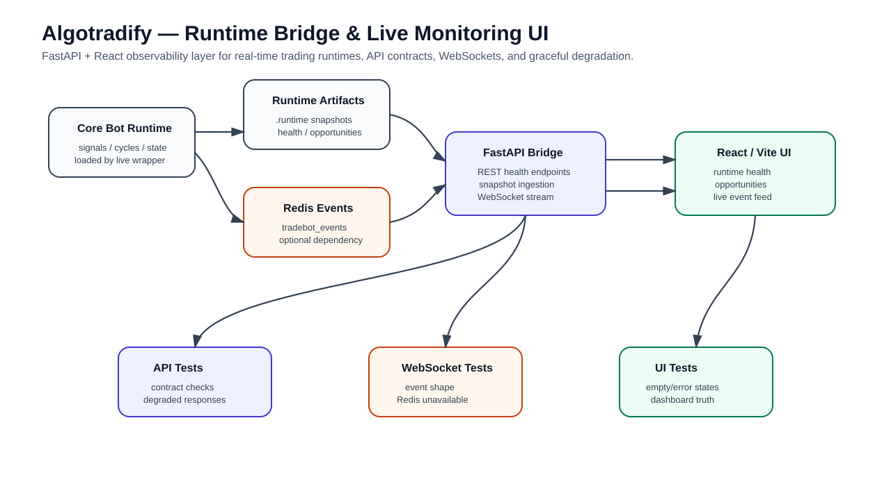
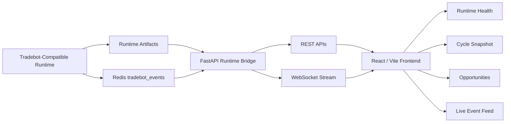

# Algotradify

[](https://github.com/ramgolladi1503-sys/algotradify/actions/workflows/portfolio-ci.yml)

**Runtime bridge and live monitoring UI for real-time trading systems.**

Algotradify connects a trading engine runtime to a FastAPI backend and React frontend so operators can monitor health, opportunities, snapshots, and live events in one place.

This repository is positioned as a portfolio-grade example of backend QA, API automation, WebSocket validation, runtime observability, and fintech platform testing.

---

## Portfolio assets

- [Architecture image](docs/architecture/algotradify-architecture.svg)
- [SDET platform one-pager](docs/one-pagers/sdet-platform-portfolio.md)
- [Test reports guide](docs/test-reports/README.md)
- [Tradebot core alignment workflow](docs/tradebot-core-alignment.md)
- LinkedIn: https://www.linkedin.com/in/ram-golladi

---

## Architecture image



---

## Problem statement

Real-time trading systems fail in messy ways. The issue is not only whether a strategy generates a signal. The real problem is whether the system can explain what is happening during live runtime:

- Is the runtime alive?
- Is market data fresh?
- Are opportunities visible?
- Are events flowing?
- Is Redis available?
- Can the dashboard degrade safely?
- Can API and WebSocket contracts be tested repeatedly?

Algotradify solves the observability and runtime bridge layer around a trading engine.

---

## Architecture



---

## Current architecture

- `main.py`: canonical Algotradify runtime entrypoint. It starts the Tradebot-compatible runtime and does not start Streamlit.
- `runtime_contract.py`: shared runtime root, artifact root, and preflight contract used by CLI and API.
- `scripts/preflight_runtime.py`: CLI preflight checker for runtime health before startup.
- `strategies/`: strategy contract and registry layer that emits candidate drafts only.
- `candidate_truth/`: Candidate Truth Layer that normalizes candidate identity, classifies real/synthetic/fallback/advisory/malformed records, merges blockers/warnings, and preserves provenance.
- `core_bot/`: optional embedded copy of the Tradebot runtime copied from `ramgolladi1503-sys/tradebot` `main`.
- `ALGOTRADIFY_ENGINE_ROOT`: explicit external engine root override.
- `TRADEBOT_ROOT`: optional pointer to a separate local Tradebot checkout.
- `CORE_BOT_ROOT`: compatibility alias for a separate local Tradebot checkout.
- `runner/live_wrapper.py`: compatibility wrapper that delegates to `main.py`.
- `api/server.py`: FastAPI runtime bridge, WebSocket stream, strategy registry API, Candidate Truth API, and runtime preflight API.
- `frontend/`: Vite React UI for runtime health, snapshot, opportunities, and live events.

---

## Canonical runtime command

Use this as the primary runtime command:

```bash
python main.py
```

Compatibility command for older scripts:

```bash
python -m runner.live_wrapper
```

The wrapper must remain thin. It should not contain separate runtime-root resolution logic.

---

## Tradebot alignment modes

Tradebot remains the engine source of truth until Algotradify owns the full engine directly.

### Mode A — External Tradebot checkout

This is safest while developing because it does not copy engine code into Algotradify:

```bash
export TRADEBOT_ROOT=/absolute/path/to/tradebot
python main.py
```

You can also use the explicit Algotradify variable:

```bash
export ALGOTRADIFY_ENGINE_ROOT=/absolute/path/to/tradebot
python main.py
```

The runtime resolver checks that the target has `main.py`, `core/`, and `config/`.

### Mode B — Embedded synced core

Use this when Algotradify needs to be self-contained:

```bash
python scripts/sync_tradebot_core.py --source ../tradebot --force
python main.py
```

The sync utility copies Tradebot into `core_bot/`, excludes runtime artifacts, logs, tokens, env files, local DBs, caches, and large local data files, then writes `core_bot/TRADEBOT_SOURCE.json`.

Full details: [Tradebot core alignment workflow](docs/tradebot-core-alignment.md)

---

## Runtime root priority

Both `main.py` and `api/server.py` must use the same engine-root priority:

1. `ALGOTRADIFY_ENGINE_ROOT`
2. `TRADEBOT_ROOT`
3. `CORE_BOT_ROOT`
4. `./core_bot`
5. `../tradebot`
6. `~/tradebot`

Runtime artifact root priority:

1. `CORE_BOT_RUNTIME_ROOT`
2. selected engine root `.runtime`
3. selected engine root `runtime`
4. `./core_bot/.runtime`
5. `./core_bot/runtime`

---

## Runtime preflight

Before starting PAPER or LIVE mode, run:

```bash
python scripts/preflight_runtime.py
```

For machine-readable output:

```bash
python scripts/preflight_runtime.py --json
```

The API exposes the same shared preflight contract:

```bash
curl http://localhost:8000/runtime/preflight
```

Preflight checks include:

- compatible runtime root discovery
- required `main.py`
- required `core/`
- required `config/`
- required `requirements.txt`
- runtime artifact root existence
- runtime artifact root writability
- execution mode validity
- broker token expectation for PAPER/LIVE

Preflight status meanings:

- `PASS`: startup contract looks valid.
- `WARN`: usable for SIM/dev but something important is missing, such as broker token.
- `FAIL`: do not start live/paper runtime until fixed.

---

## Strategy contract

Strategies in Algotradify emit **candidate drafts only**. They must not mark trades executable, resolve broker contracts, bypass readiness gates, or create orders.

A strategy draft includes:

- `candidate_id`
- `symbol`
- `strategy_id`
- `setup_family`
- `direction`
- `confidence`
- `entry_hypothesis`
- `invalidation_hypothesis`
- `required_market_regime`
- `required_data`
- `signal_features`
- `blockers`
- `warnings`
- `provenance`
- `raw`

Current strategy registry endpoint:

```bash
curl http://localhost:8000/strategies
```

Candidate draft preview endpoint:

```bash
curl 'http://localhost:8000/strategies/draft-candidates?symbol=NIFTY&orb_retest_score=85'
```

Important: these drafts are not executable trades. They are inputs for the Candidate Truth Layer and Opportunity Layer.

---

## Candidate Truth Layer

The Candidate Truth Layer converts strategy drafts and runtime-shaped opportunity rows into strict candidate truth records.

It classifies candidates as:

- `REAL`
- `SYNTHETIC`
- `FALLBACK`
- `ADVISORY`
- `MALFORMED`
- `UNKNOWN`

A candidate truth record includes:

- normalized candidate identity
- normalized symbol
- strategy id
- setup family
- truth status
- merged blockers
- merged warnings
- provenance
- normalized payload
- raw payload
- `is_candidate_truth_record=true`
- `is_execution_decision=false`

Candidate Truth endpoints:

```bash
curl http://localhost:8000/candidate-truth
```

```bash
curl 'http://localhost:8000/strategies/draft-candidates/truth?symbol=NIFTY&orb_retest_score=85'
```

Important: Candidate Truth does not decide execution readiness. A `REAL` candidate is still not executable until later readiness, broker contract, quote freshness, liquidity, risk, and selector gates pass.

---

## What is integrated

- `python main.py` boot path surfaces real import/runtime failures instead of hiding them.
- Compatibility wrapper delegates to `main.py`.
- Runtime can run against an external Tradebot checkout via `ALGOTRADIFY_ENGINE_ROOT`, `TRADEBOT_ROOT`, or `CORE_BOT_ROOT`.
- Runtime can run against embedded synced Tradebot under `core_bot/`.
- Backend resolves runtime artifacts from `CORE_BOT_RUNTIME_ROOT`, external Tradebot, or embedded `core_bot/`.
- Backend exposes runtime endpoints:
  - `GET /health`
  - `GET /runtime/health`
  - `GET /runtime/preflight`
  - `GET /runtime/snapshot`
  - `GET /opportunities?limit=...`
  - `GET /candidate-truth`
  - `GET /strategies`
  - `GET /strategies/draft-candidates?symbol=...&<feature>=...`
  - `GET /strategies/draft-candidates/truth?symbol=...&<feature>=...`
- Backend WebSocket endpoint:
  - `/ws`
  - forwards Redis `tradebot_events`
  - supports `REDIS_HOST`, `REDIS_PORT`, and `TRADEBOT_REDIS_CHANNEL`
  - emits `runtime_snapshot` updates
  - degrades cleanly if Redis is unavailable
- Frontend renders:
  - runtime health
  - cycle snapshot
  - opportunity table
  - live event feed

---

## Tech stack

- Python 3.11+
- FastAPI
- Uvicorn
- Redis
- WebSockets
- React
- Vite
- JavaScript / TypeScript-ready frontend structure
- Runtime artifact ingestion
- Local developer workflow

---

## Test strategy

This project should be tested like a production runtime bridge, not a static frontend.

### Backend tests

- Health endpoint contract tests.
- Runtime preflight contract tests.
- Strategy registry contract tests.
- Strategy candidate draft tests.
- Candidate Truth Layer classification tests.
- Candidate Truth API tests.
- Runtime snapshot parsing tests.
- Opportunity endpoint response-shape tests.
- Redis-unavailable degradation tests.
- WebSocket connection and event-forwarding tests.
- Runtime-root parity tests for `main.py` and `api/server.py`.
- Wrapper delegation tests for `runner/live_wrapper.py`.

### Frontend tests

- Runtime health rendering tests.
- Empty-state tests when no runtime artifacts exist.
- Opportunity table rendering tests.
- WebSocket reconnect/degraded-state tests.
- Error boundary tests.

### End-to-end checks

- Run runtime preflight.
- Start Redis.
- Start backend.
- Start frontend.
- Start runtime through `python main.py`.
- Verify health, preflight, snapshot, opportunity, strategy registry, candidate truth, and WebSocket event flow.

See: [Test reports guide](docs/test-reports/README.md)

---

## Failure modes handled

- Redis unavailable: WebSocket degrades instead of crashing hard.
- Tradebot import failure: runtime boot path surfaces the real error.
- Missing embedded `core_bot/`: runtime gives a specific fix path instead of a vague `ModuleNotFoundError`.
- Missing runtime artifacts: API returns safe empty/degraded states.
- Invalid execution mode: preflight fails.
- Missing PAPER/LIVE broker token candidate: preflight fails.
- Missing SIM broker token candidate: preflight warns.
- Strategy output cannot claim executable status.
- Candidate Truth output cannot claim executable status.
- Missing candidate identity becomes `MALFORMED` with blockers.
- Fallback/synthetic/advisory candidates are visible instead of hidden.
- No opportunities: UI shows an honest empty state.
- Backend unavailable: frontend shows connection failure clearly.
- WebSocket interruption: UI does not pretend live data is still flowing.

---

## Prerequisites

- Python 3.11+
- Node.js 18+
- Redis on `localhost:6379`
- A local Tradebot checkout if using external mode

---

## Setup

```bash
# API dependencies
pip install -r api/requirements.txt

# Frontend dependencies
npm --prefix frontend install
```

If using embedded sync mode, sync Tradebot first and then install its dependencies:

```bash
python scripts/sync_tradebot_core.py --source ../tradebot --force
pip install -r core_bot/requirements.txt
```

If using external checkout mode, install dependencies from Tradebot directly:

```bash
pip install -r /absolute/path/to/tradebot/requirements.txt
```

---

## Run locally

Use separate terminals.

### 1. Runtime preflight

```bash
python scripts/preflight_runtime.py
```

### 2. Redis

```bash
redis-server
```

### 3. Backend

```bash
python -m uvicorn api.server:app --host 0.0.0.0 --port 8000
```

### 4. Frontend

```bash
npm --prefix frontend run dev -- --host 0.0.0.0 --port 3000
```

### 5. Runtime

External Tradebot checkout:

```bash
export TRADEBOT_ROOT=/absolute/path/to/tradebot
python main.py
```

Embedded synced core:

```bash
python scripts/sync_tradebot_core.py --source ../tradebot --force
python main.py
```

Compatibility wrapper:

```bash
python -m runner.live_wrapper
```

---

## Local checks

- Backend health: `http://localhost:8000/health`
- Runtime preflight: `http://localhost:8000/runtime/preflight`
- Runtime health: `http://localhost:8000/runtime/health`
- Runtime snapshot: `http://localhost:8000/runtime/snapshot`
- Opportunities: `http://localhost:8000/opportunities?limit=20`
- Candidate Truth: `http://localhost:8000/candidate-truth`
- Strategy registry: `http://localhost:8000/strategies`
- Strategy draft preview: `http://localhost:8000/strategies/draft-candidates?symbol=NIFTY&orb_retest_score=85`
- Strategy truth preview: `http://localhost:8000/strategies/draft-candidates/truth?symbol=NIFTY&orb_retest_score=85`
- Frontend: `http://localhost:3000`

---

## Environment knobs

- `ALGOTRADIFY_ENGINE_ROOT`: explicit path to a Tradebot-compatible runtime root. Highest engine-root priority.
- `TRADEBOT_ROOT`: path to a local Tradebot checkout.
- `CORE_BOT_ROOT`: alternate compatibility name for Tradebot root.
- `CORE_BOT_RUNTIME_ROOT`: explicit runtime artifact root. Highest artifact-root priority.
- `REDIS_HOST`: default `localhost`.
- `REDIS_PORT`: default `6379`.
- `TRADEBOT_REDIS_CHANNEL`: default `tradebot_events`.

Frontend config is defined in `frontend/.env.example`:

- `VITE_API_BASE_URL`
- `VITE_WS_URL`
- `NEXT_PUBLIC_API_BASE_URL`
- `NEXT_PUBLIC_WS_URL`

---

## Extended endpoint compatibility

Some alternate UI builds in this repo history also attempt these endpoints if present:

- `/runtime/risk`
- `/runtime/execution`
- `/opportunities/:id`
- `/trades/:id`
- `/incidents`
- `/verification-checks`
- `/analytics/pnl-curve`
- `/analytics/candidate-volume`
- `/analytics/blocker-frequency`
- `/analytics/strategy-hit-rate`

---

## Screenshots / demo

- Screenshots: architecture image added.
- Demo video: not recorded yet.

Planned demo flow:

1. Run runtime preflight.
2. Start Redis, backend, frontend, and runtime through `python main.py`.
3. Show runtime preflight endpoint.
4. Show runtime health endpoint.
5. Show runtime snapshot in the UI.
6. Show strategy registry, draft candidate preview, and Candidate Truth output.
7. Stream live events through WebSocket.
8. Kill Redis and show graceful degradation.
9. Restore Redis and verify recovery.

---

## Roadmap

### Phase 1 — Runtime confidence

- Add backend tests for all current endpoints.
- Add WebSocket contract tests.
- Add Redis-unavailable regression tests.
- Add frontend empty/error state tests.

### Phase 2 — Operator dashboard depth

- Risk panel.
- Execution panel.
- Incident panel.
- Verification checks.
- PnL and blocker analytics.

### Phase 3 — Production readiness

- Docker Compose for full local stack.
- GitHub Actions test workflow.
- Typed API contracts.
- Structured logs.
- Demo dataset.
- Screenshots and short demo video.

---

## Portfolio value

This project demonstrates backend QA, API testing, WebSocket testing, runtime observability, graceful degradation, candidate normalization, and full-stack monitoring for fintech-style real-time systems.
