# Algotradify

[](https://github.com/ramgolladi1503-sys/algotradify/actions/workflows/portfolio-ci.yml)

**Runtime bridge, candidate pipeline, and live monitoring UI for trading systems.**

Algotradify connects a Tradebot-compatible runtime to a FastAPI backend and React frontend so operators can monitor runtime health, opportunities, candidate truth, lifecycle evidence, outcome replay, and live events.

---

## Problem statement

A trading signal is not automatically tradable. Algotradify explains candidate survival across strategy output, candidate truth, opportunity ranking, contract evidence, market evidence, risk evidence, execution readiness, trade quality score, top executable selector, fill lifecycle sync, outcome logging and replay, replay drilldowns and outcome analytics UI, richer frontend filtering and outcome analytics charts, persisted UI preferences and operator views, and Control Tower UI.

---

## Architecture

```mermaid
flowchart LR
    A[Runtime Artifacts] --> B[FastAPI Runtime Bridge]
    B --> C[Strategy Contract]
    C --> D[Candidate Truth Layer]
    D --> E[Opportunity Layer]
    E --> F[Broker Contract Readiness]
    F --> G[Quote Freshness and Liquidity Gates]
    G --> H[Unified Execution Readiness Contract]
    H --> I[Trade Quality Score]
    I --> J[Top Executable Selector]
    J --> K[Fill Lifecycle Sync]
    K --> L[Outcome Logging and Replay]
    L --> M[Replay Drilldowns and Outcome Analytics UI]
    M --> N[Richer Frontend Filtering and Outcome Analytics Charts]
    N --> O[Persisted UI Preferences and Operator Views]
    O --> P[Control Tower UI]
```



---

## Canonical runtime command

```bash
python main.py
```

Compatibility wrapper:

```bash
python -m runner.live_wrapper
```

---

## Runtime root priority

Both `main.py` and `api/server.py` use the same priority:

1. `ALGOTRADIFY_ENGINE_ROOT`
2. `TRADEBOT_ROOT`
3. `CORE_BOT_ROOT`
4. `./core_bot`
5. `../tradebot`
6. `~/tradebot`

---

## Runtime preflight

```bash
python scripts/preflight_runtime.py
python scripts/preflight_runtime.py --json
curl http://localhost:8000/runtime/preflight
```

---

## Strategy contract

Strategies emit candidate drafts only. They do not create orders or bypass readiness gates.

```bash
curl http://localhost:8000/strategies
curl 'http://localhost:8000/strategies/draft-candidates?symbol=NIFTY&orb_retest_score=85'
```

---

## Candidate Truth Layer

Candidate Truth normalizes strategy drafts and runtime rows into `REAL`, `SYNTHETIC`, `FALLBACK`, `ADVISORY`, `MALFORMED`, or `UNKNOWN` records.

```bash
curl http://localhost:8000/candidate-truth
```

---

## Opportunity Layer

Opportunity Layer tracks:

```text
normalize -> classify -> rank -> select -> emit
```

It reports raw, truth, rankable, ranked, blocked, dropped, and selected counts.

```bash
curl http://localhost:8000/opportunity-layer
```

---

## Broker contract resolver

The resolver standardizes option contract lookup: `EXACT`, `FALLBACK`, `NOT_FOUND`, `COVERAGE_FAILED`, and `INVALID_REQUEST`.

Core rule: no exact match plus no safe fallback returns `OPTION_TOKEN_NOT_FOUND`, not a crash.

---

## Broker contract readiness

Broker contract readiness attaches contract evidence to a candidate truth record. `RESOLVED_EXACT` and `RESOLVED_FALLBACK` are evidence only, not order permission.

---

## Quote freshness and liquidity gates

Market readiness evaluates quote age, depth age, bid/ask spread, spread percentage, and slippage budget. Fresh market evidence still does not mean an order can be sent.

---

## Unified execution readiness contract

This is the only layer allowed to set:

```json
{"execution_allowed": true}
```

It combines Candidate Truth, Opportunity Layer, Broker Contract Readiness, Quote Freshness and Liquidity Gates, and risk readiness. Missing risk readiness blocks by default.

---

## Execution readiness API

```bash
curl http://localhost:8000/execution-readiness
curl 'http://localhost:8000/strategies/draft-candidates/execution-readiness?symbol=NIFTY&orb_retest_score=85'
```

The API exposes evidence only. It does not call broker APIs and does not place orders.

---

## Runtime evidence wiring

`GET /execution-readiness` reads optional runtime JSON artifacts and wires them into readiness.

Broker evidence filenames:

```text
broker_contract_readiness_latest.json
contract_readiness_latest.json
broker_readiness_latest.json
```

Market evidence filenames:

```text
market_readiness_latest.json
quote_liquidity_latest.json
quote_readiness_latest.json
```

Risk evidence filenames:

```text
risk_readiness_latest.json
risk_latest.json
```

Files may live under `.runtime/` or `.runtime/logs/`. Payloads may be a list, a single record, or an object with `records`, `items`, `broker_contract_readiness`, `market_readiness`, `quote_liquidity`, `risk_readiness`, or `risk`.

Matching uses `candidate_id`, `symbol`, `tradingsymbol`, or `instrument_token`. Missing evidence stays blocked.

---

## Trade quality score

Trade quality ranks execution-readiness records. Blocked candidates receive `quality_score=0` and `BLOCKED_NOT_EXECUTION_READY`.

Scoring components:

- candidate confidence
- broker contract exact/fallback evidence
- quote freshness
- liquidity/spread quality
- risk status

Penalties include warnings, broker fallback, market warnings, and risk warnings.

Endpoint:

```bash
curl http://localhost:8000/trade-quality
```

Hard rule: trade quality ranking does not place orders and does not turn blocked candidates into executable trades.

---

## Top executable selector

The top executable selector chooses the best candidate from trade quality ranking.

Endpoint:

```bash
curl http://localhost:8000/top-executable
curl 'http://localhost:8000/top-executable?min_quality_score=70'
```

Selection rules:

- candidate must have `execution_allowed=true`
- candidate must meet `min_quality_score`
- highest quality score wins
- rejected candidates keep `selector_rejection_reasons`

Hard rule: top executable selection is still not an order. It does not call broker APIs and does not place trades.

---

## Fill lifecycle sync

Fill lifecycle sync normalizes local order/fill evidence into current lifecycle state.

Endpoint:

```bash
curl http://localhost:8000/fill-lifecycle
curl 'http://localhost:8000/fill-lifecycle?candidate_id=c1'
```

Supported lifecycle states:

```text
ORDER_INTENT_CREATED
ORDER_SUBMITTED
ORDER_ACCEPTED
ORDER_REJECTED
PARTIALLY_FILLED
FILLED
CANCELLED
EXIT_SUBMITTED
EXIT_FILLED
POSITION_CLOSED
UNKNOWN
```

Supported artifact filenames:

```text
fill_lifecycle_latest.json
order_lifecycle_latest.json
fills_latest.json
orders_latest.json
fill_lifecycle.jsonl
order_lifecycle.jsonl
fills.jsonl
orders.jsonl
```

Files may live under `.runtime/` or `.runtime/logs/`.

Hard rule: fill lifecycle sync reads evidence only. It does not submit, modify, cancel, or exit orders.

---

## Outcome logging and replay

Outcome replay normalizes selected, blocked, submitted, accepted, rejected, filled, exited, and closed evidence into an auditable candidate timeline.

Endpoint:

```bash
curl http://localhost:8000/outcome-replay
curl 'http://localhost:8000/outcome-replay?candidate_id=c1'
```

Supported outcome statuses:

```text
SELECTED
BLOCKED
SUBMITTED
ACCEPTED
REJECTED
PARTIALLY_FILLED
FILLED
EXITED
CLOSED
UNKNOWN
```

Supported artifact filenames:

```text
outcome_replay_latest.json
outcomes_latest.json
trade_outcomes_latest.json
selection_outcomes_latest.json
outcome_replay.jsonl
outcomes.jsonl
trade_outcomes.jsonl
selection_outcomes.jsonl
```

Files may live under `.runtime/` or `.runtime/logs/`. Payloads may be a list, a single event, or an object with `events`, `records`, `items`, `outcome_replay`, `outcomes`, `trade_outcomes`, or `selection_outcomes`.

Hard rule: outcome replay reads evidence only. It does not submit orders, mutate broker state, or decide new trades.

---

## Replay drilldowns and outcome analytics UI

The Control Tower exposes outcome replay directly instead of hiding it behind the API.

UI capabilities:

- candidate_id filter for replay drilldown
- selected/blocked/filled/rejected counts
- best quality score from replay evidence
- terminal state visibility
- latest outcome timeline
- outcome blockers
- no-order safety flag via `is_order_action`

The UI calls:

```text
/outcome-replay
/outcome-replay?candidate_id=<candidate_id>
```

Hard rule: replay drilldowns are display-only. They do not trigger orders, mutate broker state, or decide new trades.

---

## Richer frontend filtering and outcome analytics charts

The Control Tower includes operator-grade local filtering and simple chart summaries.

Filters:

- candidate search/filter
- status filter
- blocked-only view
- selected-only view
- allowed-only view
- rejected-only view
- quality score threshold filter

Charts:

- Readiness Breakdown Chart
- Outcome Counts Chart
- Quality Score Distribution Chart
- Candidate Truth Breakdown Chart

Hard rule: filters and charts are local UI controls only. They do not call broker APIs, submit orders, mutate runtime state, or bypass readiness gates.

---

## Persisted UI preferences and operator views

The Control Tower saves local operator preferences in browser `localStorage` so a refresh does not wipe the operator setup.

Persisted preferences:

- filter state
- replay candidate id
- selected operator view

Operator views:

- Default view
- Blocked focus
- Trade-ready focus
- Replay focus
- Lifecycle focus

Controls:

- Reset filters
- Reset to default view

Hard rule: persisted preferences are browser-local UI settings only. They do not call broker APIs, submit orders, mutate backend/runtime state, or bypass readiness gates.

---

## Control Tower UI

The Vite React UI displays the full tradability pipeline instead of only runtime health and raw opportunities.

UI sections:

- Operator Views
- Runtime
- Cycle Snapshot
- Tradability Summary
- Top Executable
- Frontend Filters
- Readiness Breakdown Chart
- Outcome Counts Chart
- Quality Score Distribution Chart
- Candidate Truth Breakdown Chart
- Outcome Replay Drilldown
- Execution Readiness
- Trade Quality
- Candidate Truth
- Opportunity Layer
- Fill Lifecycle
- Raw Runtime Opportunities
- Live Event Feed

The UI polls these endpoints:

```text
/runtime/health
/runtime/preflight
/runtime/snapshot
/opportunities?limit=20
/candidate-truth?limit=20
/opportunity-layer?limit=20
/execution-readiness?limit=20
/trade-quality?limit=20
/top-executable?limit=20
/fill-lifecycle
/outcome-replay
```

Hard rule: Control Tower UI displays evidence only. It does not submit orders, call broker APIs, or bypass readiness gates.

---

## Current API endpoints

```text
GET /health
GET /runtime/health
GET /runtime/preflight
GET /runtime/snapshot
GET /opportunities
GET /candidate-truth
GET /opportunity-layer
GET /execution-readiness
GET /trade-quality
GET /top-executable
GET /fill-lifecycle
GET /outcome-replay
GET /strategies
GET /strategies/draft-candidates
GET /strategies/draft-candidates/truth
GET /strategies/draft-candidates/opportunity-layer
GET /strategies/draft-candidates/execution-readiness
WS  /ws
```

---

## Run locally

```bash
pip install -r api/requirements.txt
npm --prefix frontend install
python scripts/preflight_runtime.py
python -m uvicorn api.server:app --host 0.0.0.0 --port 8000
npm --prefix frontend run dev -- --host 0.0.0.0 --port 3000
python main.py
```

---

## Test strategy

CI runs runtime contract, preflight, strategy registry, candidate truth, opportunity layer, broker contract, market readiness, execution readiness, runtime evidence wiring, trade quality, top executable selector, fill lifecycle sync, outcome logging and replay, replay drilldowns and outcome analytics UI, richer frontend filtering and outcome analytics charts, persisted UI preferences and operator views, Control Tower UI, API, WebSocket, and schema tests.

---

## Failure modes handled

- Missing runtime root gives explicit failure.
- Invalid execution mode fails preflight.
- Redis unavailable degrades WebSocket behavior.
- Strategy output cannot claim order permission.
- Candidate Truth output cannot claim order permission.
- Missing option contract returns `OPTION_TOKEN_NOT_FOUND`.
- Fallback usage remains visible.
- Stale quote, stale depth, wide spread, and slippage budget breach are blocked.
- Missing risk readiness blocks readiness.
- Runtime evidence wiring can allow readiness only when broker, market, and risk evidence are all present and valid.
- Blocked candidates receive zero trade quality score.
- Top executable selector rejects blocked or below-threshold candidates.
- Missing fill lifecycle evidence returns `NO_FILL_LIFECYCLE_EVENTS`.
- Unknown lifecycle status is surfaced instead of hidden.
- Missing outcome evidence returns `NO_OUTCOME_EVENTS`.
- Unknown outcome status is surfaced instead of hidden.
- Control Tower UI exposes blockers, warnings, readiness, quality, selection, lifecycle, and outcome replay evidence.
- Frontend filters reduce dashboard noise without changing backend state.
- Persisted UI preferences survive refresh without changing backend/runtime state.

---

## Roadmap

Completed foundation: runtime contract, preflight, strategy contract, Candidate Truth Layer, Opportunity Layer, broker contract resolver, broker contract readiness, quote/liquidity gates, execution readiness contract, execution readiness API, runtime evidence wiring, trade quality score, top executable selector, fill lifecycle sync, outcome logging and replay, replay drilldowns and outcome analytics UI, richer frontend filtering and outcome analytics charts, persisted UI preferences and operator views, and Control Tower UI.

Next work: deeper replay analytics, optional chart library migration, and production execution-safety design.
