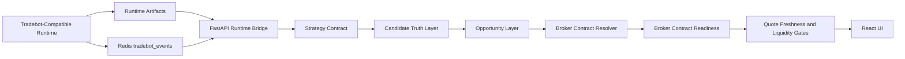

# Algotradify

[](https://github.com/ramgolladi1503-sys/algotradify/actions/workflows/portfolio-ci.yml)

**Runtime bridge, candidate pipeline, and live monitoring UI for trading systems.**

Algotradify connects a Tradebot-compatible runtime to a FastAPI backend and React frontend so operators can monitor runtime health, opportunities, candidate truth, and live events.

---

## Problem statement

A trading signal is not automatically a tradable opportunity. Real-time trading systems fail when they cannot explain:

- Is the runtime alive?
- Is the runtime root valid?
- Are candidates real, synthetic, fallback, advisory, malformed, or unknown?
- Did candidates survive normalization, classification, ranking, selection, and emit?
- Did broker contract resolution return exact, fallback, not found, coverage failed, or invalid request?
- Is broker contract readiness resolved, fallback, blocked, missing request, or coverage failed?
- Is the quote fresh, depth fresh, spread acceptable, and slippage budget respected?
- Is Redis available?
- Can API and WebSocket contracts be tested repeatedly?

Algotradify is being built as a tradability control tower, not just a table of signals.

---

## Architecture



---

## Canonical runtime command

Primary runtime command:

```bash
python main.py
```

Compatibility wrapper:

```bash
python -m runner.live_wrapper
```

The wrapper delegates to `main.py`; it must not own separate runtime-root logic.

---

## Runtime root priority

Both `main.py` and `api/server.py` use the same engine-root priority:

1. `ALGOTRADIFY_ENGINE_ROOT`
2. `TRADEBOT_ROOT`
3. `CORE_BOT_ROOT`
4. `./core_bot`
5. `../tradebot`
6. `~/tradebot`

Runtime artifact root priority:

1. `CORE_BOT_RUNTIME_ROOT`
2. selected engine root `.runtime`
3. selected engine root `runtime`
4. `./core_bot/.runtime`
5. `./core_bot/runtime`

---

## Runtime preflight

Before PAPER or LIVE mode, run:

```bash
python scripts/preflight_runtime.py
```

JSON mode:

```bash
python scripts/preflight_runtime.py --json
```

API endpoint:

```bash
curl http://localhost:8000/runtime/preflight
```

Preflight returns `PASS`, `WARN`, or `FAIL` and checks runtime root, required files, runtime artifact root, writability, execution mode, and token expectation.

---

## Strategy contract

Strategies emit **candidate drafts only**. They must not mark trades executable, resolve broker contracts, bypass readiness gates, or create orders.

Endpoints:

```bash
curl http://localhost:8000/strategies
curl 'http://localhost:8000/strategies/draft-candidates?symbol=NIFTY&orb_retest_score=85'
```

Candidate drafts are inputs for Candidate Truth and Opportunity Layer. They are not trades.

---

## Candidate Truth Layer

The Candidate Truth Layer normalizes strategy drafts and runtime-shaped opportunity rows into strict truth records.

Truth statuses:

- `REAL`
- `SYNTHETIC`
- `FALLBACK`
- `ADVISORY`
- `MALFORMED`
- `UNKNOWN`

Endpoints:

```bash
curl http://localhost:8000/candidate-truth
curl 'http://localhost:8000/strategies/draft-candidates/truth?symbol=NIFTY&orb_retest_score=85'
```

A `REAL` candidate is still not executable. It only means the candidate has usable identity/provenance and is not synthetic/fallback/advisory/malformed.

---

## Opportunity Layer

The Opportunity Layer runs the candidate pipeline:

```text
normalize -> classify -> rank -> select -> emit
```

It tracks candidate survival counts:

- `raw_count`
- `truth_count`
- `rankable_count`
- `ranked_count`
- `blocked_count`
- `dropped_count`
- `selected_count`

It also emits diagnostics for blocker and drop reasons so pipeline collapse is visible instead of hidden behind vague messages like `raw_count=0`, `no_execution_candidates`, or `FINAL_EMIT_ABORT`.

Endpoints:

```bash
curl http://localhost:8000/opportunity-layer
curl 'http://localhost:8000/strategies/draft-candidates/opportunity-layer?symbol=NIFTY&orb_retest_score=85&vwap_reclaim_score=92'
```

Important: `selected` means top-ranked opportunity candidate. It does **not** mean broker-executable trade. Broker contract readiness, quote freshness, liquidity, risk, and execution readiness are later PRs.

---

## Broker contract resolver

The broker contract resolver standardizes option contract lookup behavior.

Statuses:

- `EXACT`
- `FALLBACK`
- `NOT_FOUND`
- `COVERAGE_FAILED`
- `INVALID_REQUEST`

Core rule:

```text
No exact match + no safe fallback = NOT_FOUND with OPTION_TOKEN_NOT_FOUND blocker.
```

It must never crash by reading from a missing fallback contract. It must never hide fallback usage. It must never mark the candidate executable.

---

## Broker contract readiness

Broker contract readiness attaches resolver evidence to a candidate truth record.

Readiness statuses:

- `RESOLVED_EXACT`
- `RESOLVED_FALLBACK`
- `BLOCKED_NOT_FOUND`
- `BLOCKED_COVERAGE_FAILED`
- `BLOCKED_INVALID_REQUEST`
- `BLOCKED_MISSING_REQUEST`

Readiness includes requested contract details, resolved token evidence, fallback distance, blockers, warnings, and the original Candidate Truth record.

Important: broker contract readiness is evidence only. `RESOLVED_EXACT` or `RESOLVED_FALLBACK` still does **not** mean executable.

---

## Quote freshness and liquidity gates

Market readiness evaluates quote and liquidity evidence.

Readiness statuses:

- `READY`
- `BLOCKED_STALE_QUOTE`
- `BLOCKED_STALE_DEPTH`
- `BLOCKED_SPREAD_TOO_WIDE`
- `BLOCKED_SLIPPAGE_BUDGET`
- `BLOCKED_MISSING_QUOTE`

Evidence includes:

- `ltp`
- `bid`
- `ask`
- `quote_age_sec`
- `depth_age_sec`
- `source`
- `spread`
- `spread_pct`
- configured quote/depth/spread/slippage thresholds

Blockers include:

- `MISSING_QUOTE`
- `MISSING_LTP`
- `MISSING_BID_ASK`
- `STALE_OPTION_LTP`
- `STALE_DEPTH`
- `SPREAD_TOO_WIDE`
- `SLIPPAGE_BUDGET_EXCEEDED`

Important: fresh quote and acceptable liquidity still do **not** mean executable. Risk and full execution readiness come later.

---

## Current API endpoints

```text
GET /health
GET /runtime/health
GET /runtime/preflight
GET /runtime/snapshot
GET /opportunities
GET /candidate-truth
GET /opportunity-layer
GET /strategies
GET /strategies/draft-candidates
GET /strategies/draft-candidates/truth
GET /strategies/draft-candidates/opportunity-layer
WS  /ws
```

---

## Run locally

Install dependencies:

```bash
pip install -r api/requirements.txt
npm --prefix frontend install
```

Run services:

```bash
python scripts/preflight_runtime.py
redis-server
python -m uvicorn api.server:app --host 0.0.0.0 --port 8000
npm --prefix frontend run dev -- --host 0.0.0.0 --port 3000
python main.py
```

---

## Test strategy

Backend tests cover:

- runtime-root contract
- runtime preflight
- strategy registry
- strategy candidate drafts
- Candidate Truth Layer
- Opportunity Layer
- broker contract resolver
- broker contract readiness
- quote freshness and liquidity gates
- API contracts
- WebSocket degraded Redis behavior
- OpenAPI schema contracts

CI command:

```bash
pytest -q tests/test_runtime_contract.py tests/test_runtime_preflight.py tests/test_strategy_registry.py tests/test_candidate_truth.py tests/test_opportunity_layer.py tests/test_broker_contract_resolver.py tests/test_broker_contract_readiness.py tests/test_market_readiness.py tests/test_api_contracts.py tests/test_websocket_contracts.py tests/test_api_schema_contracts.py
```

---

## Failure modes handled

- Missing runtime root gives explicit failure.
- Invalid execution mode fails preflight.
- Missing PAPER/LIVE token candidate fails preflight.
- Redis unavailable degrades WebSocket instead of crashing.
- Strategy output cannot claim executable status.
- Candidate Truth output cannot claim executable status.
- Synthetic/fallback/advisory/malformed candidates are visible instead of hidden.
- Opportunity Layer exposes raw, blocked, dropped, ranked, and selected counts.
- Selected opportunity is not treated as executable.
- Missing option contract returns `OPTION_TOKEN_NOT_FOUND` instead of crashing.
- Fallback contract usage is visible through `fallback_used=true` and `FALLBACK_CONTRACT_USED` warning.
- Broker contract readiness preserves candidate blockers and exposes missing request/coverage/not-found states.
- Stale option LTP is blocked.
- Stale depth is blocked.
- Wide spread is blocked.
- Slippage budget breach is blocked.

---

## Roadmap

Completed foundation:

- Runtime contract stabilization
- Runtime preflight
- Strategy contract and registry
- Candidate Truth Layer
- Opportunity Layer
- Broker contract resolver contract
- Broker contract readiness
- Quote freshness and liquidity gates

Next work:

- Execution readiness contract
- Trade quality score
- Top executable selector
- Fill lifecycle sync
- Control tower UI
- Outcome logging and replay

---

## Portfolio value

This project demonstrates backend QA, API testing, WebSocket testing, runtime observability, candidate normalization, opportunity pipeline diagnostics, broker contract safety, market-data readiness, graceful degradation, and full-stack monitoring for fintech-style real-time systems.
