# Algotradify

[](https://github.com/ramgolladi1503-sys/algotradify/actions/workflows/portfolio-ci.yml)

**Runtime bridge, candidate pipeline, and live monitoring UI for trading systems.**

Algotradify connects a Tradebot-compatible runtime to a FastAPI backend and React frontend so operators can monitor runtime health, opportunities, candidate truth, and live events.

---

## Problem statement

A trading signal is not automatically tradable. Algotradify explains candidate survival across strategy output, candidate truth, opportunity ranking, contract evidence, market evidence, risk evidence, execution readiness, and trade quality score.

---

## Architecture

```mermaid
flowchart LR
    A[Runtime Artifacts] --> B[FastAPI Runtime Bridge]
    B --> C[Strategy Contract]
    C --> D[Candidate Truth Layer]
    D --> E[Opportunity Layer]
    E --> F[Broker Contract Readiness]
    F --> G[Quote Freshness and Liquidity Gates]
    G --> H[Unified Execution Readiness Contract]
    H --> I[Trade Quality Score]
    I --> J[React UI]
```



---

## Canonical runtime command

```bash
python main.py
```

Compatibility wrapper:

```bash
python -m runner.live_wrapper
```

---

## Runtime root priority

Both `main.py` and `api/server.py` use the same priority:

1. `ALGOTRADIFY_ENGINE_ROOT`
2. `TRADEBOT_ROOT`
3. `CORE_BOT_ROOT`
4. `./core_bot`
5. `../tradebot`
6. `~/tradebot`

---

## Runtime preflight

```bash
python scripts/preflight_runtime.py
python scripts/preflight_runtime.py --json
curl http://localhost:8000/runtime/preflight
```

---

## Strategy contract

Strategies emit candidate drafts only. They do not create orders or bypass readiness gates.

```bash
curl http://localhost:8000/strategies
curl 'http://localhost:8000/strategies/draft-candidates?symbol=NIFTY&orb_retest_score=85'
```

---

## Candidate Truth Layer

Candidate Truth normalizes strategy drafts and runtime rows into `REAL`, `SYNTHETIC`, `FALLBACK`, `ADVISORY`, `MALFORMED`, or `UNKNOWN` records.

```bash
curl http://localhost:8000/candidate-truth
```

---

## Opportunity Layer

Opportunity Layer tracks:

```text
normalize -> classify -> rank -> select -> emit
```

It reports raw, truth, rankable, ranked, blocked, dropped, and selected counts.

```bash
curl http://localhost:8000/opportunity-layer
```

---

## Broker contract resolver

The resolver standardizes option contract lookup: `EXACT`, `FALLBACK`, `NOT_FOUND`, `COVERAGE_FAILED`, and `INVALID_REQUEST`.

Core rule: no exact match plus no safe fallback returns `OPTION_TOKEN_NOT_FOUND`, not a crash.

---

## Broker contract readiness

Broker contract readiness attaches contract evidence to a candidate truth record. `RESOLVED_EXACT` and `RESOLVED_FALLBACK` are evidence only, not order permission.

---

## Quote freshness and liquidity gates

Market readiness evaluates quote age, depth age, bid/ask spread, spread percentage, and slippage budget. Fresh market evidence still does not mean an order can be sent.

---

## Unified execution readiness contract

This is the only layer allowed to set:

```json
{"execution_allowed": true}
```

It combines Candidate Truth, Opportunity Layer, Broker Contract Readiness, Quote Freshness and Liquidity Gates, and risk readiness. Missing risk readiness blocks by default.

---

## Execution readiness API

```bash
curl http://localhost:8000/execution-readiness
curl 'http://localhost:8000/strategies/draft-candidates/execution-readiness?symbol=NIFTY&orb_retest_score=85'
```

The API exposes evidence only. It does not call broker APIs and does not place orders.

---

## Runtime evidence wiring

`GET /execution-readiness` reads optional runtime JSON artifacts and wires them into readiness.

Broker evidence filenames:

```text
broker_contract_readiness_latest.json
contract_readiness_latest.json
broker_readiness_latest.json
```

Market evidence filenames:

```text
market_readiness_latest.json
quote_liquidity_latest.json
quote_readiness_latest.json
```

Risk evidence filenames:

```text
risk_readiness_latest.json
risk_latest.json
```

Files may live under `.runtime/` or `.runtime/logs/`. Payloads may be a list, a single record, or an object with `records`, `items`, `broker_contract_readiness`, `market_readiness`, `quote_liquidity`, `risk_readiness`, or `risk`.

Matching uses `candidate_id`, `symbol`, `tradingsymbol`, or `instrument_token`. Missing evidence stays blocked.

---

## Trade quality score

Trade quality ranks execution-readiness records. Blocked candidates receive `quality_score=0` and `BLOCKED_NOT_EXECUTION_READY`.

Scoring components:

- candidate confidence
- broker contract exact/fallback evidence
- quote freshness
- liquidity/spread quality
- risk status

Penalties include:

- warnings
- broker fallback
- market warnings
- risk warnings

Endpoint:

```bash
curl http://localhost:8000/trade-quality
```

Hard rule: trade quality ranking does not place orders and does not turn blocked candidates into executable trades.

---

## Current API endpoints

```text
GET /health
GET /runtime/health
GET /runtime/preflight
GET /runtime/snapshot
GET /opportunities
GET /candidate-truth
GET /opportunity-layer
GET /execution-readiness
GET /trade-quality
GET /strategies
GET /strategies/draft-candidates
GET /strategies/draft-candidates/truth
GET /strategies/draft-candidates/opportunity-layer
GET /strategies/draft-candidates/execution-readiness
WS  /ws
```

---

## Run locally

```bash
pip install -r api/requirements.txt
npm --prefix frontend install
python scripts/preflight_runtime.py
python -m uvicorn api.server:app --host 0.0.0.0 --port 8000
npm --prefix frontend run dev -- --host 0.0.0.0 --port 3000
python main.py
```

---

## Test strategy

CI runs runtime contract, preflight, strategy registry, candidate truth, opportunity layer, broker contract, market readiness, execution readiness, runtime evidence wiring, trade quality, API, WebSocket, and schema tests.

---

## Failure modes handled

- Missing runtime root gives explicit failure.
- Invalid execution mode fails preflight.
- Redis unavailable degrades WebSocket behavior.
- Strategy output cannot claim order permission.
- Candidate Truth output cannot claim order permission.
- Missing option contract returns `OPTION_TOKEN_NOT_FOUND`.
- Fallback usage remains visible.
- Stale quote, stale depth, wide spread, and slippage budget breach are blocked.
- Missing risk readiness blocks readiness.
- Runtime evidence wiring can allow readiness only when broker, market, and risk evidence are all present and valid.
- Blocked candidates receive zero trade quality score.

---

## Roadmap

Completed foundation: runtime contract, preflight, strategy contract, Candidate Truth Layer, Opportunity Layer, broker contract resolver, broker contract readiness, quote/liquidity gates, execution readiness contract, execution readiness API, runtime evidence wiring, and trade quality score.

Next work: top executable selector, fill lifecycle sync, control tower UI, outcome logging, and replay.
