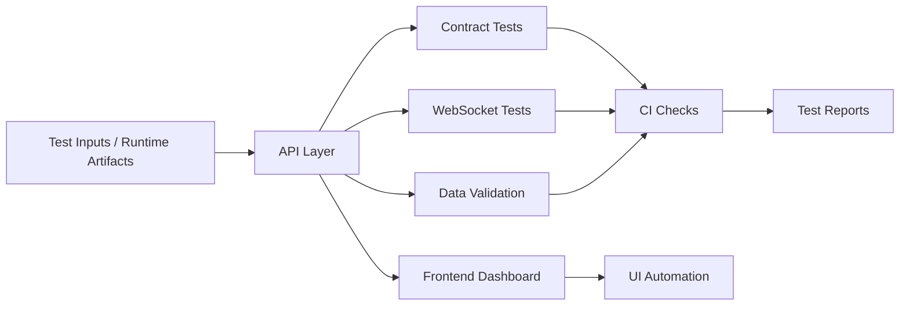

# Automation Engineering Portfolio — API, UI, WebSocket, Data, CI/CD Testing

## Positioning

A portfolio one-pager showing practical automation engineering across backend APIs, live WebSocket systems, frontend dashboards, runtime artifacts, data validation, Docker-ready workflows, and CI/CD-style health checks.

This is designed for SDET, QA Automation, Backend QA, API Automation, and Platform QA roles.

---

## Problem

Modern QA is not just clicking UI buttons. Strong SDET work requires testing systems across multiple layers:

- APIs must return stable contracts.
- WebSocket streams must handle reconnects and degraded states.
- Dashboards must not lie when data is missing.
- Runtime artifacts must be parsed safely.
- Databases and logs must reconcile with the UI.
- CI should catch failure before production.
- Test reports must explain what broke.

This portfolio demonstrates that style of testing.

---

## Architecture

---

## What it demonstrates

### Playwright / Selenium direction

- UI automation strategy for dashboard workflows.
- Empty-state validation.
- Error-state validation.
- Visual sanity checks.
- Trace and screenshot capture for failures.

### API testing

- Health endpoint validation.
- Runtime snapshot response validation.
- Opportunity endpoint contract checks.
- Negative tests for missing runtime artifacts.
- Degraded-state responses.

### WebSocket validation

- Connection lifecycle tests.
- Event payload shape tests.
- Redis unavailable scenario.
- Reconnect/degraded UI behavior.
- Runtime snapshot stream validation.

### Database and data checks

- SQLite/log consistency checks.
- Runtime artifact parsing checks.
- Trade/event schema validation.
- Data quality checks for stale/missing values.

### Docker / local stack direction

- Redis + backend + frontend + runtime wrapper local workflow.
- Planned Docker Compose stack for reproducible testing.
- Environment-based API and WebSocket configuration.

### CI/CD testing direction

- Run unit tests.
- Run API contract tests.
- Run frontend tests.
- Run offline health gate.
- Upload test reports, traces, and screenshots.

### Test reports

- Health gate reports.
- JSON/Markdown runtime reports.
- Playwright traces and screenshots.
- CI summary artifacts.

---

## Example test matrix

| Layer | What to test | Example failure caught |
|---|---|---|
| API | `/health`, `/runtime/health`, `/runtime/snapshot` | Backend running but runtime missing |
| WebSocket | `/ws` event stream | Redis down or event format changed |
| UI | Dashboard health and opportunities | UI shows stale data as live |
| Data | Runtime artifacts/logs | Missing symbol, stale LTP, bad schema |
| CI | Full regression gate | Broken import, failed contract, bad build |

---

## Tech stack

Python, FastAPI, Pytest, Playwright/Selenium direction, React, Vite, Redis, WebSockets, SQLite/log validation, Docker-ready local workflow, GitHub Actions direction, JSON/Markdown reports.

---

## Recruiter summary

This portfolio proves I can test more than simple screens. I can validate APIs, WebSockets, dashboards, runtime data, failure modes, logs, CI checks, and production-style reliability workflows.

Target roles:

- SDET
- QA Automation Engineer
- API Automation Engineer
- Backend QA Engineer
- Platform QA Engineer
- Fintech QA Engineer
- AI Product QA Engineer
